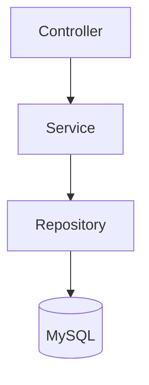

# Sistema de Hospedagem API

API REST desenvolvida em Java com Spring Boot para gerenciamento de hospedagens em residências. O sistema permite cadastro de clientes, residências e quartos, controle de reservas e aluguéis, cálculo automático de diárias, emissão de recibos e histórico de hospedagens.

---

## Objetivo

Aplicar os conceitos da disciplina de Programação Modular por meio de uma solução organizada, escalável e baseada em regras reais de negócio.

---

## Tecnologias Utilizadas

- Java 17
- Spring Boot
- Spring Web
- Spring Data JPA
- Bean Validation
- MySQL
- Maven
- Lombok
- JUnit 5
- Mockito

---

## Arquitetura

O projeto foi estruturado em camadas:

- **Controller**: endpoints REST
- **Service**: regras de negócio
- **Repository**: acesso a dados
- **Model**: entidades
- **DTO**: entrada e saída de dados
- **Exception**: tratamento global de erros

### Estrutura de Pacotes

```text
src/main/java/br/pucminas/sistema_hospedagem
├── controller
├── dto
├── enums
├── exception
├── model
├── repository
└── service
```

### Fluxo Simplificado



---

## Funcionalidades

### Clientes
- Cadastro
- Listagem
- Busca por id
- Atualização
- Exclusão
- Login por e-mail e senha

### Residências
- Cadastro
- Listagem
- Busca por id
- Atualização
- Exclusão
- Histórico de hospedagens

### Quartos
- Cadastro
- Listagem
- Busca por id
- Atualização
- Exclusão

### Reservas
- Cadastro
- Cancelamento
- Validação de conflito de datas
- Bloqueio em quarto alugado

### Aluguéis
- Cadastro
- Controle de disponibilidade
- Cálculo automático de diárias
- Controle de pagamento
- Emissão de recibo
- Histórico por residência

---

## Regras de Negócio

- Não permite reservas conflitantes
- Não permite reserva em quarto alugado
- Não permite aluguel em quarto ocupado
- Não permite aluguel com reserva ativa
- Regra do meio-dia aplicada no cálculo das diárias
- Todo aluguel gera pagamento
- Status de pagamento: `PENDENTE` e `PAGO`

---

## Como Executar

### 1. Clonar repositório

```bash
git clone URL_DO_REPOSITORIO
```

### 2. Criar banco MySQL

```sql
CREATE DATABASE sistema_hospedagem;
```

### 3. Configurar `application.properties`

```properties
spring.datasource.url=jdbc:mysql://localhost:3306/sistema_hospedagem
spring.datasource.username=root
spring.datasource.password=SUA_SENHA

spring.jpa.hibernate.ddl-auto=update
spring.jpa.show-sql=true
server.port=8080
```

### 4. Executar aplicação

```bash
.\mvnw.cmd spring-boot:run
```

### 5. Executar testes

```bash
.\mvnw.cmd clean test
```

---

## Base URL

```text
http://localhost:8080
```

---

## Endpoints Principais

### Clientes

```http
POST /clientes
POST /clientes/login
GET /clientes
GET /clientes/{id}
PUT /clientes/{id}
DELETE /clientes/{id}
```

### Residências

```http
POST /residencias
GET /residencias
GET /residencias/{id}
PUT /residencias/{id}
DELETE /residencias/{id}
GET /residencias/{id}/historico
```

### Quartos

```http
POST /quartos
GET /quartos
GET /quartos/{id}
PUT /quartos/{id}
DELETE /quartos/{id}
```

### Reservas

```http
POST /reservas
GET /reservas
GET /reservas/{id}
PATCH /reservas/{id}/cancelar
```

### Aluguéis

```http
POST /alugueis
GET /alugueis
GET /alugueis/{id}
PATCH /alugueis/{id}/pagar
GET /alugueis/{id}/recibo
```

---

## Testes Automatizados

Cobertura de cenários importantes:

- CPF duplicado
- Login inválido
- Reserva conflitante
- Reserva em quarto alugado
- Quarto ocupado
- Quarto inexistente
- Regra do meio-dia
- Cálculo de diárias

---

## Boas Práticas Aplicadas

- Arquitetura em camadas
- DTO Pattern
- Repository Pattern
- Service Layer
- Bean Validation
- Tratamento global de exceções
- Separação de responsabilidades

---

## Evoluções Futuras

- Autenticação JWT
- Criptografia de senhas
- Dashboard administrativo
- Relatórios financeiros
- Upload de imagens

---

## Autor

Pedro Lucas Soares Rezende  
Estudante de Engenharia de Software - PUC Minas